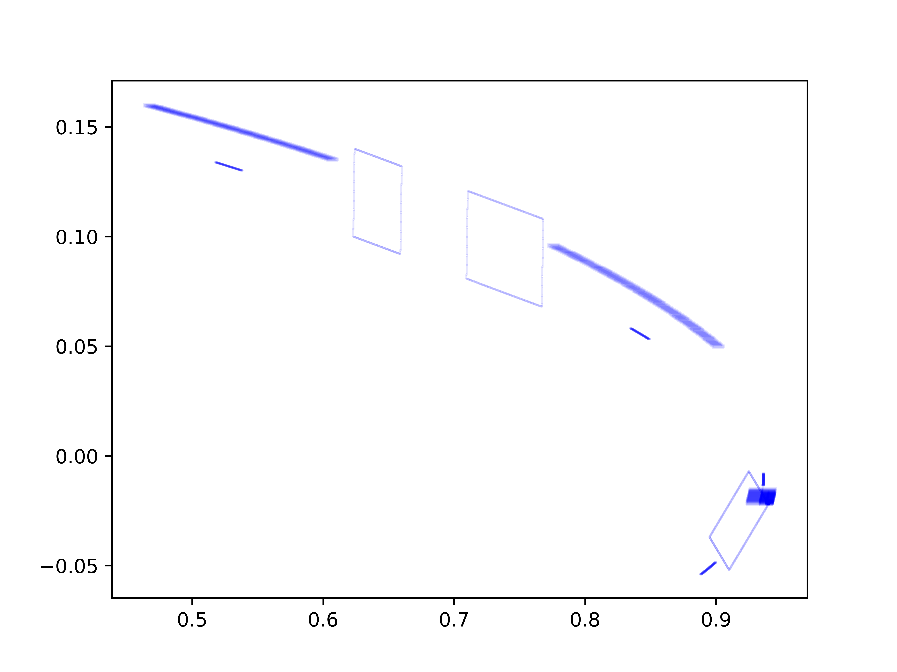

# 
# Interval analysis
This project comprises of several modules implementing [interval arithmetic](https://en.wikipedia.org/wiki/Interval_arithmetic) and its applications for rigorous numerical computation and computational dynamics.

## Interval arithmetic
The `interval_arithmetic_tools` module focuses on the implementation of the `Interval` class along with suitable arithmetic functions.

## Covering relations analysis
The `covering_relations_analysis` module implements the rigorous computation method of finding [covering relations](https://en.wikipedia.org/wiki/Covering_relation) for a given [dynamical system](https://en.wikipedia.org/wiki/Dynamical_system) as a means of restricting the entropy of the system.

## SIVIA
The `sivia_tools` module implements the [Set Inversion Via Interval Analysis (SIVIA) algorithm](https://en.wikipedia.org/wiki/Set_inversion) used as a tool in dynamical systems analysis.

### Manifold parametrization (unfinished)
The `manifold_parametrization_tools` module implements the parametrization of a topological manifold. It is in progress as of now.